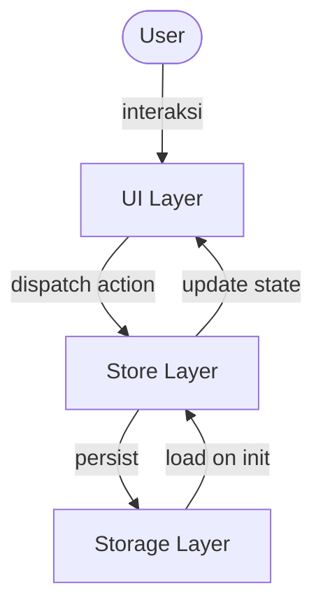

# Design Document: Todolist App

## Overview

Aplikasi Todolist adalah aplikasi web frontend berbasis Single Page Application (SPA) yang memungkinkan pengguna mengelola daftar tugas secara efisien. Aplikasi berjalan sepenuhnya di sisi klien tanpa backend, menggunakan localStorage sebagai mekanisme persistensi data.

Teknologi yang digunakan:
- **HTML5 + CSS3** — struktur dan tampilan
- **TypeScript** — logika aplikasi dengan type safety
- **Vite** — build tool dan dev server
- **Vitest + fast-check** — unit testing dan property-based testing

---

## Visual Design: Neobrutalism

Aplikasi menggunakan gaya **Neobrutalism** — estetika desain yang menggabungkan kesederhanaan fungsional dengan elemen visual yang bold dan ekspresif.

### Prinsip Utama

- **Border hitam tebal** — semua elemen interaktif (card, input, tombol) menggunakan `border: 3px solid #000`
- **Hard shadow** — bayangan hitam tajam tanpa blur: `box-shadow: 4px 4px 0px #000`
- **Warna kontras tinggi** — latar belakang menggunakan warna cerah, teks hitam pekat
- **Tipografi bold** — font weight 700–900, huruf kapital untuk label penting
- **Interaksi tegas** — efek hover menggeser elemen (translate) dan memperkecil shadow untuk simulasi "ditekan"

### Palet Warna

| Token | Nilai | Penggunaan |
|---|---|---|
| `--color-bg` | `#FFFBF0` | Latar belakang halaman (krem hangat) |
| `--color-surface` | `#FFFFFF` | Card / container utama |
| `--color-primary` | `#FFE500` | Tombol aksi utama (kuning terang) |
| `--color-accent` | `#FF6B9D` | Highlight / badge / tag aktif (merah muda) |
| `--color-danger` | `#FF3B3B` | Tombol hapus / aksi destruktif |
| `--color-success` | `#00C853` | Indikator todo selesai |
| `--color-border` | `#000000` | Semua border dan shadow |
| `--color-text` | `#0D0D0D` | Teks utama |
| `--color-text-muted` | `#555555` | Teks sekunder / placeholder |

### Komponen Visual

#### App Container
```
┌─────────────────────────────────────────┐  ← border: 3px solid #000
│  ░░░░░░░░░░░░░░░░░░░░░░░░░░░░░░░░░░░░  │     box-shadow: 6px 6px 0px #000
│  ░  📋 TODOLIST APP                  ░  │     background: #FFFFFF
│  ░░░░░░░░░░░░░░░░░░░░░░░░░░░░░░░░░░░░  │
└─────────────────────────────────────────┘
```

#### Input Field + Tombol Tambah
```
┌──────────────────────────────┐  ┌──────────┐
│  Tambah tugas baru...        │  │  TAMBAH  │  ← bg: #FFE500, border: 3px solid #000
└──────────────────────────────┘  └──────────┘     box-shadow: 4px 4px 0px #000
  ↑ border: 3px solid #000                         hover: translate(-2px, -2px)
    focus: box-shadow: 4px 4px 0px #000                   box-shadow: 6px 6px 0px #000
```

#### Todo Item
```
┌─────────────────────────────────────────────────────┐
│  ☐  Belajar TypeScript                  ✏️  🗑️     │  ← border: 3px solid #000
└─────────────────────────────────────────────────────┘     box-shadow: 4px 4px 0px #000
                                                             margin-bottom: 8px

  Completed state:
┌─────────────────────────────────────────────────────┐
│  ☑  ~~Belajar TypeScript~~              ✏️  🗑️     │  ← background: #F0F0F0
└─────────────────────────────────────────────────────┘     opacity: 0.75
```

#### Filter Tabs
```
┌──────────┐  ┌──────────┐  ┌──────────────┐
│   SEMUA  │  │  AKTIF   │  │   SELESAI    │
└──────────┘  └──────────┘  └──────────────┘
  ↑ Active tab: bg: #FF6B9D, border: 3px solid #000, box-shadow: 3px 3px 0px #000
    Inactive tab: bg: #FFFFFF, border: 3px solid #000, no shadow
```

#### Tombol Hapus Semua Selesai
```
┌──────────────────────────────┐
│  HAPUS SEMUA YANG SELESAI    │  ← bg: #FF3B3B, color: #FFFFFF
└──────────────────────────────┘     border: 3px solid #000
                                     box-shadow: 4px 4px 0px #000
                                     disabled: opacity: 0.4, no shadow
```

#### Ringkasan
```
  3 / 7 tugas selesai
  ↑ font-weight: 900, font-size: 1.1rem
    badge count: bg: #FFE500, border: 2px solid #000, padding: 2px 8px
```

### Tipografi

| Elemen | Font Size | Weight | Transform |
|---|---|---|---|
| Judul App | `2rem` | `900` | `uppercase` |
| Label tombol | `0.85rem` | `700` | `uppercase` |
| Todo title | `1rem` | `600` | — |
| Todo selesai | `1rem` | `400` | `line-through` |
| Ringkasan | `0.9rem` | `700` | — |
| Placeholder | `0.9rem` | `400` | — |

### Interaksi & Animasi

| Aksi | Efek |
|---|---|
| Hover tombol | `transform: translate(-2px, -2px)` + shadow membesar |
| Klik tombol | `transform: translate(2px, 2px)` + shadow mengecil |
| Focus input | Border tetap hitam, shadow muncul |
| Todo selesai | Background berubah ke `#F0F0F0`, teks dicoret |
| Tambah todo | Slide-in dari atas dengan `animation: slideDown 150ms ease` |
| Hapus todo | Fade-out dengan `animation: fadeOut 150ms ease` |

---

## Architecture

Aplikasi mengikuti pola **MVC sederhana** yang dipisahkan menjadi tiga lapisan:

```
┌─────────────────────────────────────────────┐
│                   UI Layer                  │
│  (DOM manipulation, event listeners, render)│
└────────────────────┬────────────────────────┘
                     │
┌────────────────────▼────────────────────────┐
│                 Store Layer                 │
│  (state management, business logic)         │
└────────────────────┬────────────────────────┘
                     │
┌────────────────────▼────────────────────────┐
│               Storage Layer                 │
│  (localStorage read/write, serialization)   │
└─────────────────────────────────────────────┘
```



---

## Components and Interfaces

### 1. `TodoItem` — Model Data

Representasi satu item todo.

```typescript
interface TodoItem {
  id: string;          // UUID unik
  title: string;       // Judul todo (non-empty, trimmed)
  completed: boolean;  // Status selesai/belum
  createdAt: number;   // Unix timestamp (ms)
}
```

### 2. `FilterType` — Enum Filter

```typescript
type FilterType = 'all' | 'active' | 'completed';
```

### 3. `AppState` — State Aplikasi

```typescript
interface AppState {
  todos: TodoItem[];
  filter: FilterType;
  editingId: string | null;  // ID todo yang sedang diedit, null jika tidak ada
}
```

### 4. `Store` — Manajemen State

Modul yang mengelola state dan business logic.

```typescript
interface Store {
  getState(): AppState;
  addTodo(title: string): void;
  toggleTodo(id: string): void;
  editTodo(id: string, newTitle: string): void;
  deleteTodo(id: string): void;
  clearCompleted(): void;
  setFilter(filter: FilterType): void;
  setEditing(id: string | null): void;
  getFilteredTodos(): TodoItem[];
}
```

### 5. `StorageService` — Persistensi

Modul yang menangani baca/tulis localStorage.

```typescript
interface StorageService {
  save(todos: TodoItem[]): void;
  load(): TodoItem[];
}
```

### 6. `UIRenderer` — Rendering DOM

Modul yang merender state ke DOM.

```typescript
interface UIRenderer {
  render(state: AppState): void;
}
```

---

## Data Models

### Struktur Todo di localStorage

Data disimpan sebagai JSON string dengan key `"todolist-app"`:

```json
[
  {
    "id": "550e8400-e29b-41d4-a716-446655440000",
    "title": "Belajar TypeScript",
    "completed": false,
    "createdAt": 1700000000000
  }
]
```

### Validasi Input

- Judul todo dianggap **valid** jika setelah di-trim panjangnya minimal 3 karakter dan maksimal 50 karakter
- Judul todo dianggap **tidak valid** jika kosong, hanya berisi whitespace, panjangnya kurang dari 3 karakter setelah di-trim, atau panjangnya lebih dari 50 karakter setelah di-trim

### Urutan Tampilan

Todo ditampilkan berdasarkan `createdAt` secara descending (terbaru di atas).

### Ringkasan

```
{jumlah completed} / {total} tugas selesai
```

---

## Correctness Properties

*A property is a characteristic or behavior that should hold true across all valid executions of a system — essentially, a formal statement about what the system should do. Properties serve as the bridge between human-readable specifications and machine-verifiable correctness guarantees.*

### Property 1: Penambahan todo memperbesar daftar

*For any* daftar todo dan judul todo yang valid (non-empty setelah trim), menambahkan todo baru harus menghasilkan daftar yang panjangnya bertambah satu, dengan todo baru memiliki status `completed = false`.

**Validates: Requirements 1.2**

### Property 2: Judul whitespace ditolak

*For any* string yang seluruhnya terdiri dari karakter whitespace (termasuk string kosong, spasi, tab, newline), mencoba menambahkannya sebagai todo harus ditolak dan daftar todo tidak berubah.

**Validates: Requirements 1.3**

### Property 10: Judul terlalu pendek ditolak

*For any* string yang setelah di-trim memiliki panjang antara 1 dan 2 karakter (inklusif), mencoba menambahkan atau menyimpan todo dengan judul tersebut harus ditolak dan daftar todo tidak berubah.

**Validates: Requirements 1.4, 4.4**

### Property 11: Judul terlalu panjang ditolak

*For any* string yang setelah di-trim memiliki panjang lebih dari 50 karakter, mencoba menambahkan atau menyimpan todo dengan judul tersebut harus ditolak dan daftar todo tidak berubah.

**Validates: Requirements 1.5, 4.5**

### Property 3: Input field dikosongkan setelah penambahan

*For any* judul todo yang valid, setelah berhasil ditambahkan ke daftar, nilai input field harus menjadi string kosong.

**Validates: Requirements 1.4**

### Property 4: Filter mengembalikan subset yang tepat

*For any* daftar todo dengan komposisi status apapun:
- Filter "all" harus mengembalikan semua todo (panjang sama dengan daftar asli)
- Filter "active" harus mengembalikan hanya todo dengan `completed = false`
- Filter "completed" harus mengembalikan hanya todo dengan `completed = true`

**Validates: Requirements 6.2, 6.3, 6.4**

### Property 5: Toggle status adalah operasi round-trip

*For any* todo dengan status apapun, melakukan toggle dua kali berturut-turut harus mengembalikan status ke nilai semula.

**Validates: Requirements 3.1, 3.2**

### Property 6: Ringkasan mencerminkan komposisi daftar

*For any* daftar todo, jumlah yang ditampilkan di ringkasan harus sama persis dengan jumlah todo yang memiliki `completed = true` dan total seluruh todo.

**Validates: Requirements 3.3**

### Property 7: Serialisasi round-trip mempertahankan data

*For any* daftar todo yang valid, menyimpan ke Storage lalu memuatnya kembali harus menghasilkan daftar yang ekuivalen — setiap field (`id`, `title`, `completed`, `createdAt`) identik dengan nilai semula.

**Validates: Requirements 8.4**

### Property 8: Hapus semua selesai menghilangkan semua completed

*For any* daftar todo, setelah operasi clearCompleted, tidak boleh ada todo dengan `completed = true` yang tersisa, dan semua todo dengan `completed = false` tetap ada.

**Validates: Requirements 7.2**

### Property 9: Tombol "Hapus Semua yang Selesai" aktif iff ada completed

*For any* daftar todo, tombol "Hapus Semua yang Selesai" harus aktif (enabled) jika dan hanya jika terdapat minimal satu todo dengan `completed = true`.

**Validates: Requirements 7.1, 7.3**

---

## Error Handling

| Skenario | Penanganan |
|---|---|
| Judul todo kosong/whitespace | Tampilkan pesan validasi, tidak tambah/simpan todo |
| Judul todo kurang dari 3 karakter (setelah trim) | Tampilkan pesan validasi, tidak tambah/simpan todo |
| Judul todo lebih dari 50 karakter (setelah trim) | Tampilkan pesan validasi, tidak tambah/simpan todo |
| localStorage tidak tersedia | Mulai dengan daftar kosong, tidak tampilkan error ke user |
| Data di localStorage corrupt/invalid JSON | Tangkap exception saat parse, mulai dengan daftar kosong |
| ID todo tidak ditemukan saat edit/delete | Operasi diabaikan secara diam-diam (no-op) |
| Pengguna batal konfirmasi hapus | Dialog ditutup, todo tidak dihapus |

---

## Testing Strategy

### Unit Tests (Vitest)

Fokus pada skenario spesifik dan edge case:

- Validasi input: judul kosong, judul whitespace, judul valid
- Toggle todo: dari active ke completed dan sebaliknya
- Edit todo: simpan perubahan, batal edit
- Hapus todo: konfirmasi dan batal
- Filter: setiap tipe filter dengan berbagai komposisi data
- Ringkasan: perhitungan jumlah selesai/total
- Storage: load saat data tidak ada, load saat data corrupt

### Property-Based Tests (Vitest + fast-check)

Library: **fast-check** (JavaScript/TypeScript PBT library)

Setiap property test dikonfigurasi minimum **100 iterasi**.

Setiap test diberi tag komentar dengan format:
`// Feature: todolist-app, Property N: <deskripsi singkat>`

| Property | Deskripsi | Modul yang Diuji |
|---|---|---|
| P1 | Penambahan todo memperbesar daftar | `store.addTodo` |
| P2 | Judul whitespace ditolak | `store.addTodo` + validasi |
| P3 | Input field dikosongkan setelah penambahan | UI + store |
| P4 | Filter mengembalikan subset yang tepat (all/active/completed) | `store.getFilteredTodos` |
| P5 | Toggle status adalah round-trip | `store.toggleTodo` |
| P6 | Ringkasan mencerminkan komposisi daftar | `store.getState` + UI |
| P7 | Serialisasi round-trip mempertahankan data | `StorageService` |
| P8 | Hapus semua selesai menghilangkan semua completed | `store.clearCompleted` |
| P9 | Tombol aktif iff ada completed | `store.getState` + UI |
| P10 | Judul terlalu pendek ditolak (1–2 karakter setelah trim) | `store.addTodo` + `store.editTodo` + validasi |
| P11 | Judul terlalu panjang ditolak (>50 karakter setelah trim) | `store.addTodo` + `store.editTodo` + validasi |

### Integration Tests

- Alur lengkap: tambah → edit → toggle → hapus
- Persistensi: reload halaman memuat data yang sama
